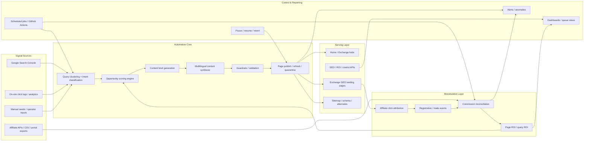
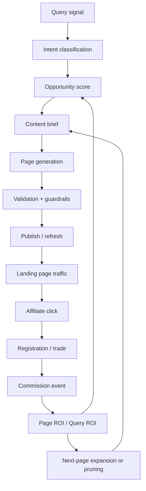
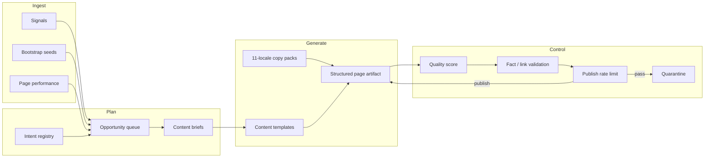
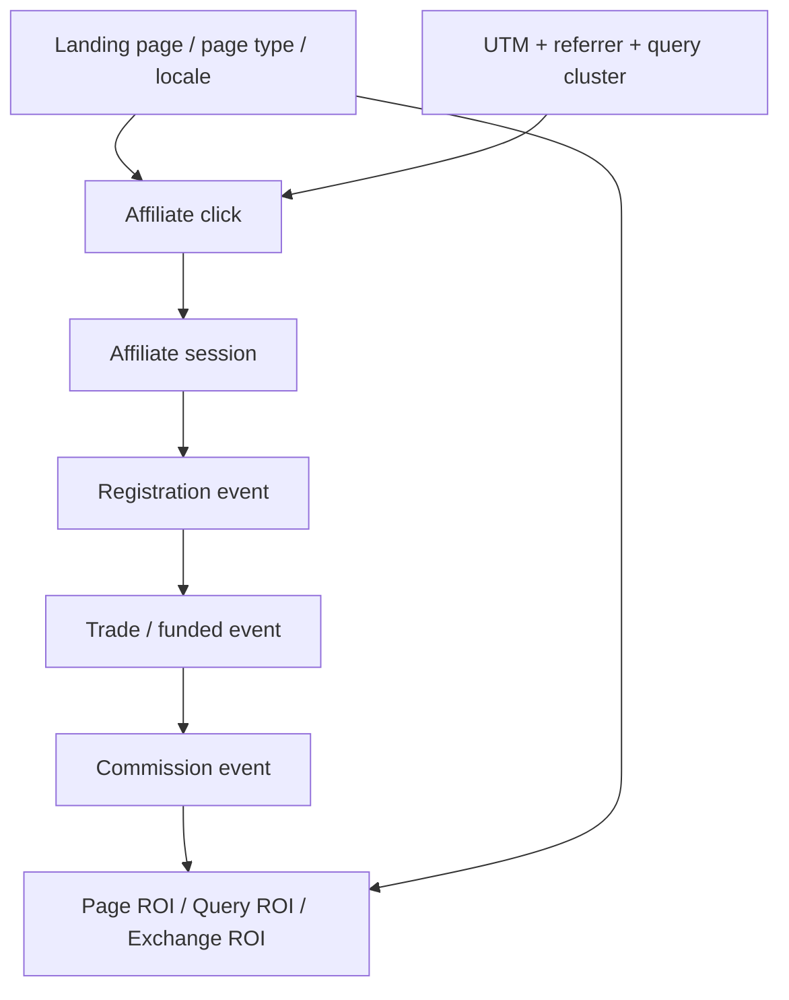
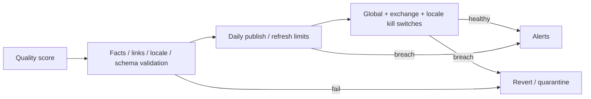
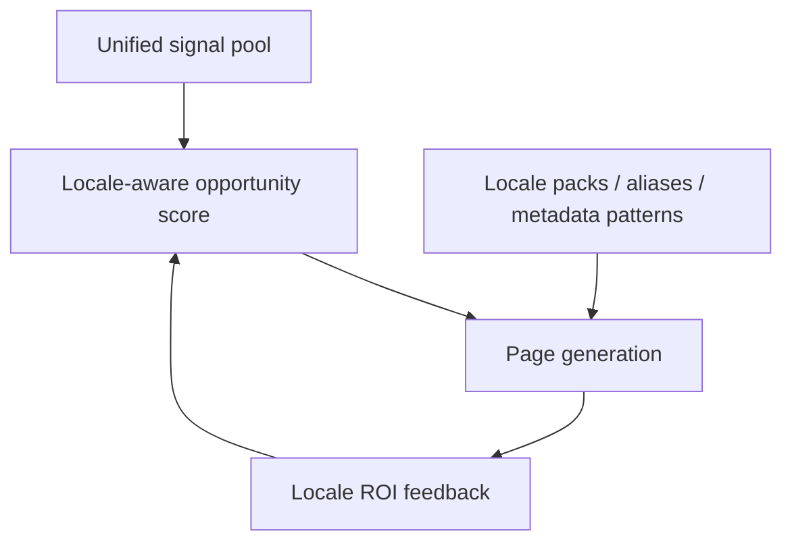

> 入口：
> - [Project Index](/Users/yangshu/.openclaw/workspace/projects/007-cryptorebate-restored/INDEX.md)
> - [README](/Users/yangshu/.openclaw/workspace/projects/007-cryptorebate-restored/README.md)

# 007 SEO/GEO 自动化架构图 v1

## 目标

把 007 从“多语言 GEO 内容站”升级成“全自动 Query-to-Cash 增长系统”：

1. 自动发现 query
2. 自动判断哪些 query 值得扩页
3. 自动生成并发布 GEO 页面
4. 自动把页面收入、点击和收益归因回 query / locale / exchange / page type
5. 自动决定下一批最赚钱的页面

固定主链路：

**Search demand → GEO landing page → Affiliate click → Registration / trading → Commission → ROI feedback → Next page expansion**

---

## 1. System Landscape

---

## 2. Query-to-Cash Flow

---

## 3. Autonomous Content Engine

**实现口径**

- 现有 `exchange-seo.ts` 是 bootstrap seed，不再是唯一内容源
- 正式自动化内容来自机会引擎和模板引擎
- 页面状态机：`generated → validated → published → refresh_due / underperforming / quarantined / deprecated`

---

## 4. Revenue Attribution Flow

**固定归因规则**

- 主归因：`query_cluster + page_url + locale + exchange_slug + page_type`
- 默认窗口：
  - click → registration：30 天
  - click → commission：90 天滚动
- 默认模型：站内 `last-click`
- 同时保留 `first-landing-page`，用于衡量 SEO 首触点价值

---

## 5. Control & Guardrails

**硬规则**

- 质量分低于阈值不可发布
- facts / referral code / referral link / locale mismatch 不可发布
- schema、metadata、dead-link 校验失败直接 quarantine
- 支持：
  - global pause
  - exchange-level quarantine
  - locale-level quarantine
  - page-level revert

---

## 6. 11-Locale Operating Model

**运行原则**

- 11 语种走同一自动化主链
- 不允许“中英真页面、其它语种翻译壳页”
- locale 优先级由收益和机会分数动态决定，不人工写死

---

## 数据流与自动化边界

### 自动化范围

- 自动 ingest query / click / earnings 信号
- 自动聚类、评分、扩页、刷新、降权、下线
- 自动生成 sitemap / alternates / schema 适配页面资产池
- 自动输出 ROI / queue / alerts

### 非自动化输入

- partner API 凭据
- CSV / portal 数据接入配置
- 法律披露和品牌边界文本的根规则

### 自动化边界

- 默认允许自动发布
- 不允许跳过 guardrails
- 一旦 risk signal 命中，系统优先 quarantine，而不是继续扩张

---

## 阶段性验收指标

### P1：系统层闭环成立

- 自动机会队列可用
- 自动内容生成可用
- 自动 publish / refresh / quarantine 可用
- API 与 dashboard 数据可读

### P2：变现层闭环成立

- page ROI / query ROI 可回溯
- 7 家交易所都进入收益模型
- 按 locale / exchange / page type 看收入成立

### P3：增长层闭环成立

- 高 ROI query 自动扩相邻长尾页
- 低表现页面自动降权或下线
- 7 天无人干预可稳定运行

---

## 当前实现映射

- 内容与 query 基座：`web/src/lib/automation/*`
- GEO / 页面 serving：`web/src/app/[locale]/**`
- API 层：`web/src/app/api/**`
- 自动任务：`web/scripts/run-automation-pipeline.ts`
- 控制面与种子数据：`web/src/data/automation/**`
- 快照输出：`web/src/data/generated/automation-state.json`

